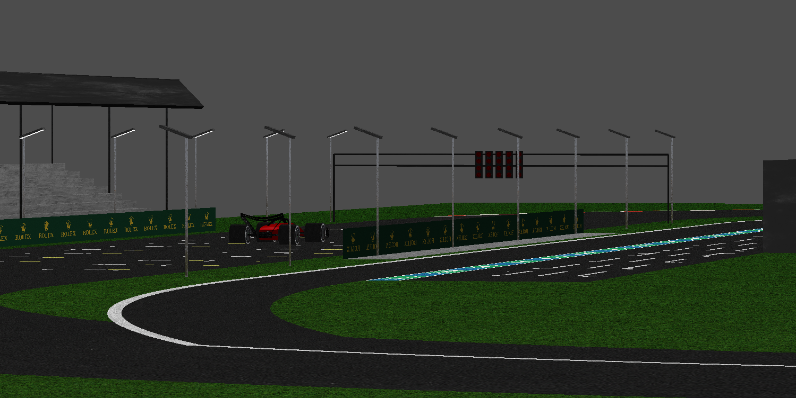
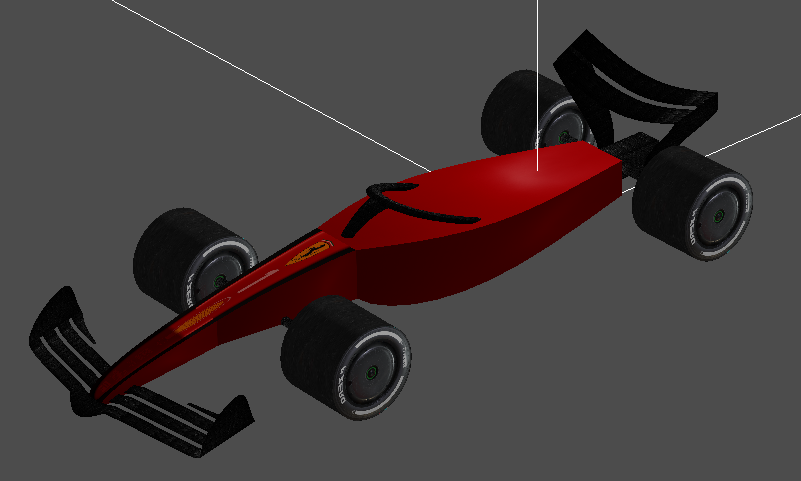
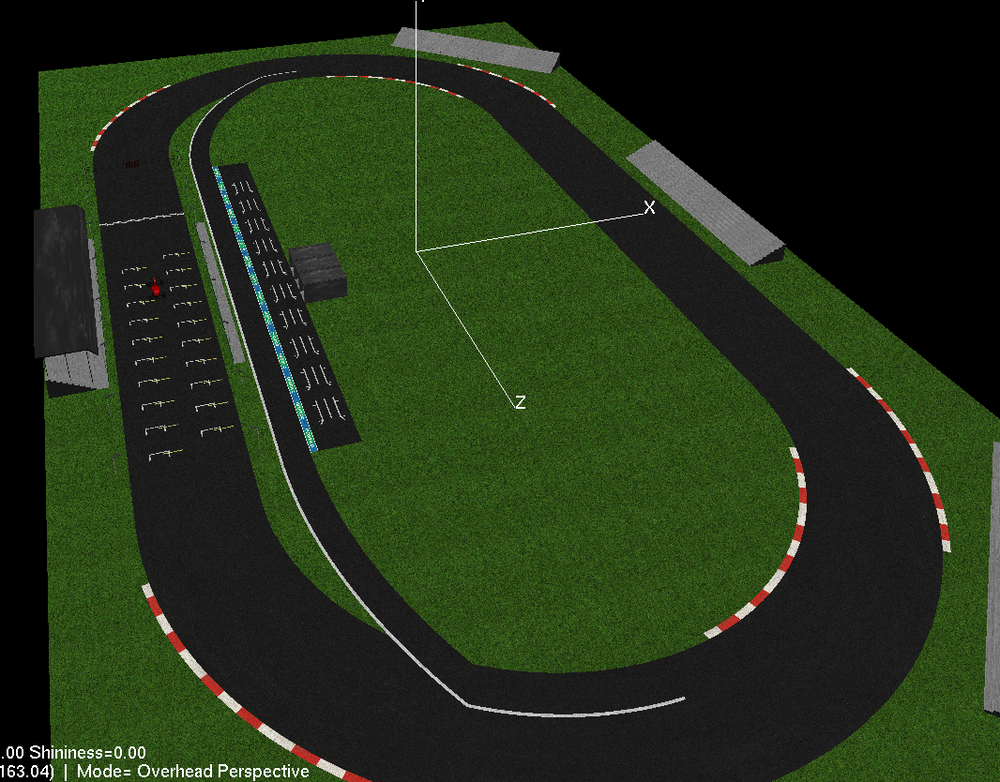

# F1-Starting-Grid
An OpenGL demo rendering a 3D Formula 1 starting grid with detailed car models, track markings and dynamic lighting.

Images of The Scene

First Person View

Car View

OverHead Perspective View

Key bindings

    Arrow Keys: 
                1. Change View Angle in (Oblique overhead perspective/ orthogonal) 
                2. Navigate the scene in First person perspective
                    (Up and Down arrow) to move forward and backward
                    (left and right arrow) to rotate about the camera axis
                 
    0: Reset View Angle

    a/A: Turn Axis on/off

    c/C: View only the Car or View entire scene (acts as a toggle button)

    ESC: Exit

    m/M: swicth between (Oblique Overhead Perspective, Orthogonal and First Person Perspective Projection)
  
    +/- : to zoom out/zoom in when in Oblique overhead perspective or First person perspecive

    a/A : to decrease and increase Ambient Lighting respectively

    s/S : to decrease and increase Specular Lighting respectively

    d/D : decrease and increase Diffusion Lighting respectively

    e/E : decrease and increase Emmitance Lighting respectively

    n/N : decrease and increase Shininess respectively

    i/I : to turn on/off the lighting

    y/Y: to decrease and increase the height of light source respectively

    w/W: to decrease and increase the movement of light in X direction

    l/L: to decrease and increase the movement of light in Z direction

    ' ': Space bar press will stop the light at it's current position

    Mouse Click: Selects one of the 3 garages that you can see beside the pit lane track and prints the selected object on screen.

Instructions to Run:

    Navigate to the directory with the source code and run 

    1. make

    2. ./final

Note:

    1. I've Added a Front Wing and rear wing to the car, you can view only the car with a 'c/C' Key press.

    2. I’ve chosen the garage to demonstrate 3D object selection because, since the floor isn’t part of the garage, you’ll see the object only gets selected when you click on its walls or roof. This proves that the second stage of my selection i.e., the per-triangle hit test works.

<!-- Aknowlegments:

    1. The imports were taken from example. Didn't make any modifications as it had all the header files i needed.

    2. ErrCheck(const char*) : void, Taken from  example.

    3. Print(const char* format, ...): void, Taken form  example.

    4. special(int, int, int): void, taken from  example.

    5. reshape(int, int): void, taken from and modified the dim value to fit my View.

    6. LoadTexBMP(const char* ): unsigned int , taken from  example.

    7. I've referred to https://www.geeksforgeeks.org/dsa/cubic-bezier-curve-implementation-in-c/ for Bezier curve concept. What differs from the website, they only implemented for 3 control points. I have created a for loop to work for any number of points.

    8. Tangent equations were taken from this wiki page, https://en.wikipedia.org/wiki/B%C3%A9zier_curve

    9. Most of the fuctions have the basic building blocks inspired from examples

    10. For the per triangle intersection verification for 3D object selection. I've used multiple sources to understand the concept. Since I've lost touch with pointer in C, I took ChatGPT's help to store the vertexs in the structure pickable across different c files(this is the structure that contains all the object information like center id etc.)
    sources: https://www.scratchapixel.com/lessons/3d-basic-rendering/minimal-ray-tracer-rendering-simple-shapes/ray-sphere-intersection.html?utm_source=chatgpt.com, https://www.youtube.com/watch?v=fK1RPmF_zjQ, https://en.wikipedia.org/wiki/M%C3%B6ller%E2%80%93Trumbore_intersection_algorithm?utm_source=chatgpt.com -->

Code Structure and Description:

    1. The main entry point is final.c. This is where all the objects are called and rendered. It also has partial logic for 3D selection, where the window coordinates are converted into world coordinates and the start and direction of the projected ray are found.

    2. objects.c has all the scene-related object-creation code. Here I have registered each vertex of the garage roof and wall to the pickable structure for 3D selection.

    3. car folder has all the code pertaining to the object 

        3.1: Halo.c has a structure similar to torus, but I modified the central axis to follow a custon line.

        3.2: Wing.c and RearWing.c The wing blades are built using a combination of bezier curves and sin to get a good curvature.

        3.4: Monocoque.c Uses Bezier curves and sin function.

        3.5: Util.h/Util.c Has utility function, to find cross and dot product, registering the selectable object etc.

    3. car.c renders all the above mentioned parts together.

    4. print.c has the function to print to the window.

    5. errcheck.c has the function to catch errors.

    6. loadtexbmp.c has a function to load .bmp files as a texture

Time Taken for this assigment: ~ 45-50 Hours (including all kinds of formatting, Trial & Error)

Most Time consuming tasks for me:

    1. The Halo object on the car:
        Since the axis of the halo tube was custom (traced by a Bezier curve), I had to find the normal and binormal at each step of the curve and then use those vectors to find the vertices of the tube. (I totally underestimated the time it would take to do this.)

    2. Finding the Coordinates of the object in World View.
        Initially, I was directly rendering the ModelView matrix where I created the object and applied transformations to my coordinates to get the world coordinates. I was stuck here for a very long time. Later, I realized that I wasn't taking into account that the ModelView matrix at the object creation point also included the values from the camera coordinates we set at projection time. I then stored the matrix right after projection and multiplied its inverse with the ModelView matrix, which gave me the correct world-coordinate values.

